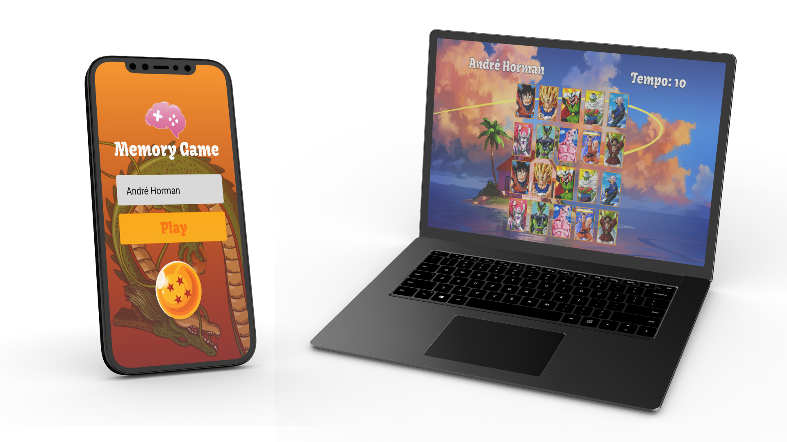

<h1 align="center">
  

  MEMORY GAME DBZ
</h1>

  <a href="#bookmark-sobre">Sobre</a>&nbsp;&nbsp;&nbsp;|&nbsp;&nbsp;&nbsp;
  <a href="#rocket-tecnologias">Tecnologias</a>&nbsp;&nbsp;&nbsp;|&nbsp;&nbsp;&nbsp;
  <a href="#paintbrush-layout">Layout</a>&nbsp;&nbsp;&nbsp;|&nbsp;&nbsp;&nbsp;
  <a href="https://memory-game-dbz.vercel.app/" target="_blank">Aplicação na Vercel</a>

  

## :bookmark: Sobre

O **Memory Game DBZ** é uma aplicação Web desenvolvida em ReactJS, que consiste em um jogo da memória com os personagens do anime Dragon Ball Z. A aplicação possui uma tela inicial de Login e uma tela de jogo, onde o usuário deve encontrar os pares de cartas iguais com o menor tempo possível.

Para executar a aplicação, realize os passos a seguir:

* Clone o repositório ou realize um fork para o seu GitHub.
* Entre no diretório do projeto --> `cd memory-game-dbz`.
* Instale as dependências do projeto --> `npm install`.
* Execute a aplicação --> `npm run dev`.

 

  

## :rocket: Tecnologias

  - `React JS`
  > Biblioteca JavaScript para construção de interfaces de usuário.
  - `TypeScript`
  > Linguagem de programação que adiciona tipagem estática ao JavaScript.
  - `Tailwind CSS`
  > Framework CSS que utiliza a metodologia CSS-in-JS.
  - `Vercel`
  > Plataforma de hospedagem voltada para aplicações web modernas e escaláveis.

## :paintbrush: Layout

🔗 [LINK DO FIGMA](https://www.figma.com/file/XTig7FzyzQTBiFgmQ72KLq/Memory-Game-DBZ?type=design&node-id=0%3A1&mode=dev)

---
